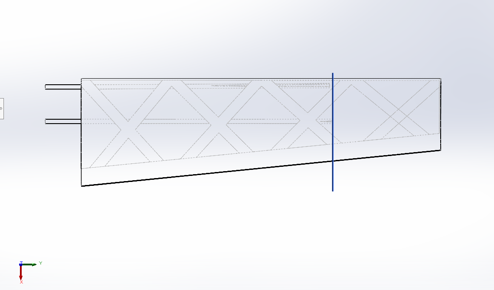
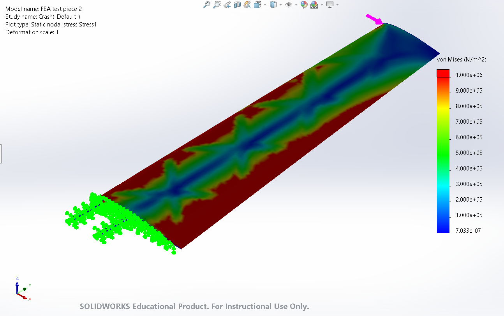
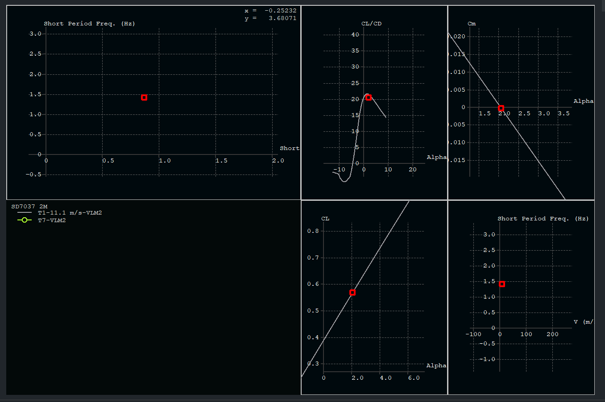

## RC Plane Structural & Flight Dynamics Design  

### 1.0 Overview  
A modular RC aircraft designed and optimized for structural efficiency, crash resilience, and manufacturability. Developed using **SolidWorks**, **XFLR5**, and **Flow5**. The project began as an RC plane and, as of September 2025, has gone through multiple redesign phases focusing on wing structures.

---

### 2.0 Features  
The initial design featured a fuselage mounted on top of the wing, inspired by gliders I observed at Akaflieg. It was later changed to a more conventional configuration, with wings slotted into the fuselage using carbon fiber rods. This improved manufacturability and simplified servo wiring installation.

- **Foils:** SD7037, NACA 0010  
- **Wingspan:** 2 m  
- **Wing Area:** 0.5 m²  
- **Wing Loading:** 2.8 kg/m²  
- **Aspect Ratio:** 8  

---

#### 2.1 Fuselage Design  
- Lightweight aerodynamic shell housing the ESC, radio, battery, and motor  
- Fully modeled with detailed internal structures  

  
  

  
  

---

#### Note: Limitations of FEA in SolidWorks
- Not orientation-based  
- Material properties approximated using PET instead of LW-PLA  

---

#### 2.2 Traditional Wing & Spar Configuration  
- Conventional spar-and-rib design for baseline aerodynamic performance  
- Rough FEA stress analysis performed to identify structural weak points under worst-case crash loads  

  
  

  
  

---

#### 2.3 Cross-Braced Wing Configuration  
- Innovative cross-braced layout for improved load distribution  
- Comparative FEA simulations performed against the traditional design for strength-to-weight optimization  

  
  

  
  

---

#### 2.5 Flight Dynamics Analysis  
- Aerodynamic modeling performed in **XFLR5** and **Flow5** for lift, drag, and stability assessment  
- Parametric studies conducted to balance wing loading, stability, and crash resilience

