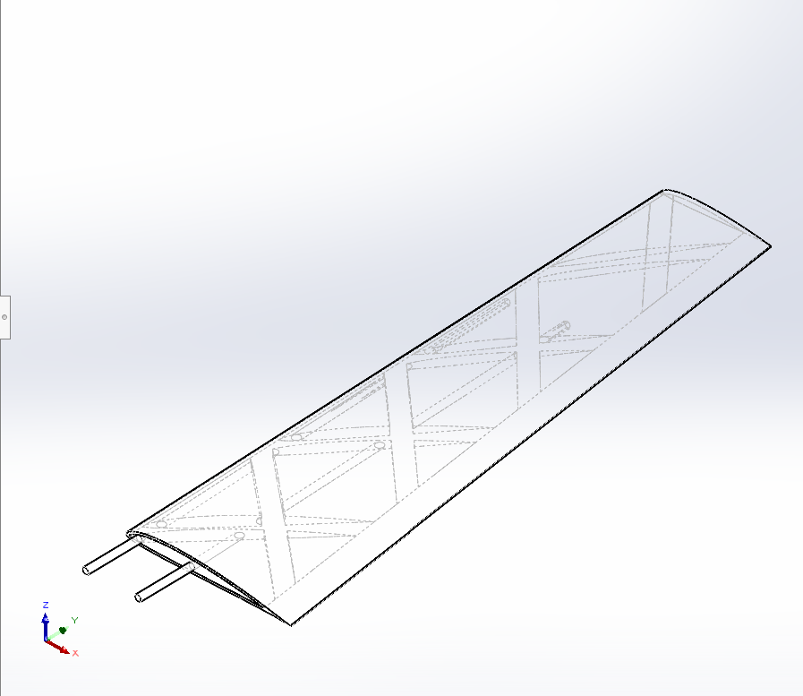
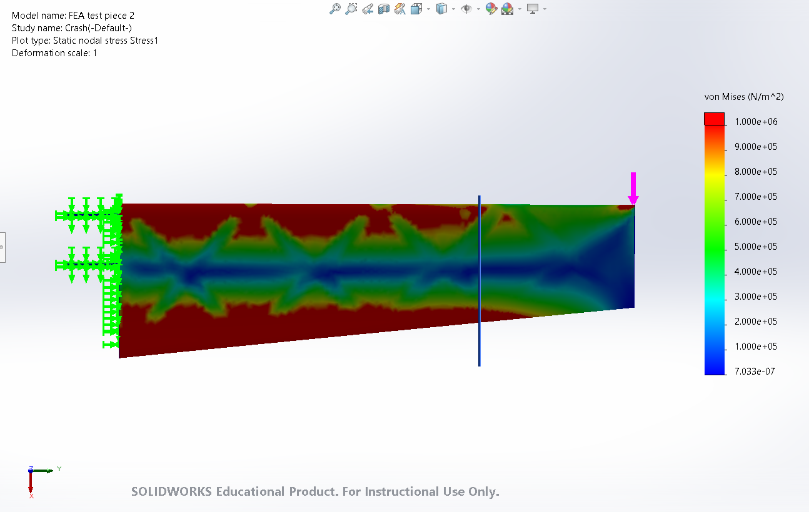

## RC Plane Structural & Flight Dynamics Design  

### 1.0 Overview  
A modular RC aircraft designed and optimized for structural efficiency, crash resilience, and manufacturability. Developed using **SolidWorks**, **XFLR5**, and **Flow5**. The project began as a RC plane project and as of Septemver 2025, has been in phases of redesign due to wing structure.

### 2.0 Features  
Intital design has configuration of fusalage sitting on wing, inspired by gliders I saw in Akaflieg. Design was changed to a tradition one, with wings slotted into the fusalage using carbon fiber rods. This was done for manufacturability and ease of installation for the servo wirings.
- Foils: SD7037, NACA 0010
- Wingspan: 2m
- wing area: 0.5 m^2
- wing loading 2.8 kg/m^2
- Aspect Ratio: 8

#### 2.1 Fuselage Design  
- Light weight aerodynmic shell used to house ESC, radio, battery and motor
- Fully completed with detailed internal structures

!

#### Note: Limitions of FEA in solidworks
- Non orentation based
- Using values for PET instead of LW-PLA

#### 2.2 Traditional Wing & Spar Configuration  
- Conventional spar-and-rib design for baseline aerodynamic performance  
- Rough FEA stress analysis to identify structural weak points during a worse case crash

#### 2.3 Cross-Braced Wing Configuration  
- Innovative cross-braced layout for improved load distribution  
- Comparative FEA simulations against traditional design for strength-to-weight optimization

#### 2.5 Flight Dynamics Analysis  
- Aerodynamic modeling performed in **XFLR5** and **Flow5** for lift, drag, and stability assessment  
- Parametric studies to balance wing loading, stability, and crash resilience  
